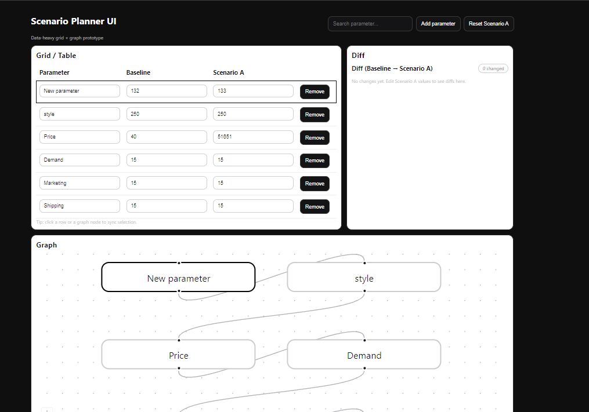

# Scenario Planner UI (Grid + Graph)

A frontend-biased fullstack portfolio project inspired by Fluxion-style workflows: a **data-heavy UI** where users model scenarios using an editable **grid/table** and a connected **graph view**, with room to add **AI-assisted scenario generation**.

> Goal: turn complex models into an intuitive, responsive user experience.

---

## Screenshot



# Scenario Planner UI

A data-intensive web application for modeling alternative scenarios using a structured grid interface and a linked graph visualization.

---

## Overview

Scenario Planner UI allows users to:

- Edit structured parameters in a tabular grid
- Visualize dependencies and relationships in a graph view
- Maintain synchronized state between multiple representations
- Validate changes before applying them
- Compare baseline and scenario states

The main focus of the project is data integrity, predictable state management, and clean architecture.

---

## Motivation

The goal of this project was to explore how complex, interdependent data can be edited safely while maintaining consistency across different UI representations.

Instead of prioritizing feature count, I focused on:

- Clear data flow
- Separation of concerns
- Explicit validation layers
- Reducing hidden side effects in state transitions

---

## Tech Stack

- **Frontend:** React, TypeScript
- **State Management:** Structured centralized state patterns
- **Backend (mocked/local):** REST-based validation structure
- **Architecture:** Modular component design
- **Tooling:** Vite, npm, Git

---

## Architecture Notes

The application separates:

- Presentation logic (UI components)
- Business rules (validation and scenario comparison)
- Data modeling (structured entities and relationships)

A centralized state model ensures:

- Grid and graph remain synchronized
- Validation occurs before state mutation
- Reduced risk of inconsistent UI updates

---

## Running the Project

### 1. Clone the repository

```bash
git clone http://github.com/Awais-Baddar/scenario-planner-ui
cd scenario-planner-ui
